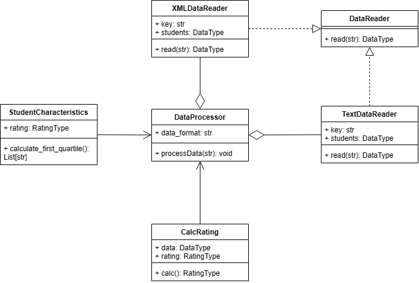

# Лабораторная 1 по дисциплине "Технологии программирования и средства разработки систем искусственного интеллекта"
## 5 вариант

## Цель:
1. Получить навыки работы с системой контроля версий Git;
2. Получить навыки рефакторинга;
3. Получить навыки работы с Unit-тестами;
4. Получить навыки работы с непрерывной интеграцией и непрерывным развертыванием.

## Индивидуальное задание

⋅⋅* Формат входного файла: XML
⋅⋅* Поставленная задача для расчёта: Рассчитать и вывести на экран количество студентов попавших в первый квартиль

## UML-диаграмма классов


## Список изменений
1. calcRating
```py
class CalcRating:
    def __init__(self, data: DataType) -> None:
        self.data: DataType = data  # информация о студентах
        self.rating: RatingType = {}  # будет заполнен рейтингами студентов

    def calc(self) -> RatingType:
        for key in self.data:  # Для каждого студента
            self.rating[key] = 0.0  # начальное значение рейтинга
            for subject in self.data[key]:  # для каждого предмета
                # (имя предмета и оценка) студента
                self.rating[key] += subject[1]  # суммирование оценок
            self.rating[key] /= len(self.data[key])  # сумма оценок делится
            # на количество предметов у студента
        return self.rating  # ключами являются имена студентов,
        # а значениями - их рейтинги
```
2. DataReader
```py
class DataReader(ABC):

    @abstractmethod
    def read(self, path: str) -> DataType:
        pass
```
абстрактный метод, который ожидает конкретной реализации, класса DataReader принимает аргумент path, 
представляющий путь к файлу, возвращает структуру, представленную DataType(словарь, в котором ключи -
строки (имена), значения - списки кортежей с предметоп и оценкой
3. mainProgram
```py
class DataProcessor:
    def __init__(self, data_format):
        self.data_format = data_format

    def processData(self, path):  # принимает путь к файлу
        _, file_extension = os.path.splitext(path)  # путь к файлу на базовое
        # имя и расширение.
        # Результат присваивается file_extension.
        # _ отбросит то, что осталось ЗА сплитом, эдакая заглушка
        if file_extension == ".txt":
            reader = TextDataReader()
        elif file_extension == ".xml":
            reader = XMLDataReader()
        else:
            raise ValueError("Unsupported file format. Use '.txt' or '.xml'.")

        students = reader.read(path)  # читаем с пути
        print("Students: ", students)

        rating = CalcRating(students).calc()  # объекту CalcRating даем
        # данные(кортеж то бишь студент: предмет-оценка)
        print("Rating: ", rating)

        student_char = StudentCharacteristics(rating)  # сюда даем рейтинг

        first_quartile_students = student_char.calculate_first_quartile()
        # счтаем квартиль
        print("First Quartile Students: ", first_quartile_students)


def main():
    parser = argparse.ArgumentParser(description="Path to data file")
    parser.add_argument("-p", dest="path", type=str,
                        required=True, help="Path to data file")
    args = parser.parse_args()

    data_processor = DataProcessor(args.path)
    data_processor.processData(args.path)


if __name__ == "__main__":
    main()
```
Был добавлен ООП-подход - программа получает на вход путь и вызывает класс DataProcessor, который 
извлекает расширение файла, вызывает необходимый обработчик. После чтения файла, класс вызывает другой 
класс для вычислений.
4. StudentCharacteristics
```py
class StudentCharacteristics:
    def __init__(self, rating: RatingType) -> None:
        self.rating = rating  # словарь

    def calculate_first_quartile(self) -> List[str]:
        # получаем словарь
        ratings = list(self.rating.values())  # содержит все рейтинги студентов

        # вычисляем квартиль
        first_quartile = np.percentile(ratings, 75)

        # студенты у которых рейтинг в первом квартиле
        first_quartile_students = [student for student, student_rating
                                   in  # перечисленоие по кортежу
                                   self.rating.items()  # пары ключ=знач с
                                   # студентом и рейтингом
                                   if student_rating >= first_quartile]
        # очевидно если выше 75%

        return first_quartile_students
```
Функция `calculate_first_quartile` берёт словарь студентов, содержащий рейтинг студентов и 
вычисляет квартиль. На выход идут студенты, прошедшие по условию.
5. TextDataReader
```py
class TextDataReader(DataReader):
    def __init__(self) -> None:
        self.key: str = ""  # студент
        self.students: DataType = {}  # ключ студент, знач -
        # спсиок предмет+оценка

    def read(self, path: str) -> DataType:
        # Открываем указанный текстовый файл для чтения
        # с указанной кодировкой UTF-8
        with open(path, encoding='utf-8') as file:
            for line in file:
                # Перебираем строки в файле
                if not line.startswith(" "):
                    # Если строка не с пробела, это студент
                    # определяем ключ (студента)
                    self.key = line.strip()
                    self.students[self.key] = []  # создает
                    # пустой список и связывает со студентом
                else:
                    # Если строка с пробела, это предмет+оценка
                    # Разделяем строку на 2 части по символу :
                    subj, score = line.split(":", maxsplit=1)
                    # создаем кортеж с именем предмета и оценкой
                    # и вяжем к студенту
                    self.students[self.key].append(
                        (subj.strip(), int(score.strip())))
        return self.students
```
6. Type
```py
DataType = dict[str, list[tuple[str, int]]]
```
7. XMLDataReader
```py
class XMLDataReader(DataReader):
    def __init__(self) -> None:
        self.key: str = ""
        self.students: DataType = {}

    def read(self, path: str) -> DataType:
        # Открываем указанный XML-файл для чтения с указанной кодировкой UTF-8
        with open(path, encoding='utf-8') as file:
            # Создаем объект ElementTree и загружаем XML-данные из файла
            tree = ET.parse(file)
            root = tree.getroot()
            # Для каждого элемента <student>
            for student_elem in root.findall('student'):
                # Извлекаем имя студента
                self.key = student_elem.find('name').text
                # Создаем пустой список для предметов и оценок
                self.students[self.key] = []
                # Для каждого элемента <subject> внутри <student>
                for subject_elem in student_elem.findall('subject'):
                    # Извлекаем имя предмета
                    subj = subject_elem.find('name').text
                    # Извлекаем оценку и в число
                    score = int(subject_elem.find('score').text)
                    # Добавляем предмет и оценку в список для студента
                    self.students[self.key].append((subj, score))
        return self.students
```
